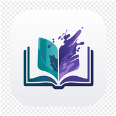

<p align="center">
  
</p>

<h1 align="center">墨境 MoRealm</h1>

<p align="center">
  <strong>一款现代化的 Android 电子书阅读器</strong><br>
  基于 Jetpack Compose · 兼容 Legado 书源 · GPL-3.0 + 商业双许可
</p>

<p align="center">
  
  
  
  
</p>

---

## 功能亮点

- **多格式支持** — EPUB / TXT / PDF / MOBI / AZW3 / CBZ / CBR
- **Canvas 渲染引擎** — 自研排版，全文搜索、书签、目录、正文净化
- **5 种翻页动画** — 平移、覆盖、仿真、上下滚动、无动画
- **5 套阅读预设** — 纸质 / 护眼 / 海蓝 / 暖黄 / 墨白，自动适配日夜模式
- **精细排版控制** — 字体 / 字号 / 行距 / 段距 / 页边距 / 繁简转换 / 自定义 CSS
- **TTS 朗读** — Edge TTS / 系统 TTS / OpenAI / 自定义 API，支持语速调节
- **书源生态** — 兼容 Legado 书源，CSS / XPath / JSONPath / Regex 四模式规则引擎
- **6 套内置主题** — 墨境 / 纸上 / 赛博朋克 / 森林 / 深夜 / 墨水屏，支持自定义主题
- **云同步** — WebDAV 备份 / 本地 ZIP 备份恢复
- **阅读统计** — 年度阅读报告 · 阅读时长追踪

> 📖 完整使用指南请查看 [docs/user-guide.md](docs/user-guide.md)

## 构建

```bash
git clone https://github.com/keys-cherish/morealm-reader.git
cd morealm-reader
./gradlew assembleDebug    # macOS / Linux
gradlew.bat assembleDebug  # Windows
```

APK 输出：`app/build/outputs/apk/debug/app-debug.apk`

## 许可证

本项目采用 **双许可模式**：

- **开源使用** — [GPL-3.0](LICENSE)：个人、学习、开源项目免费使用，但衍生作品必须开源
- **商业使用** — 需获取商业许可：闭源分发、商业产品等场景请联系作者

详见 [LICENSE](LICENSE)
